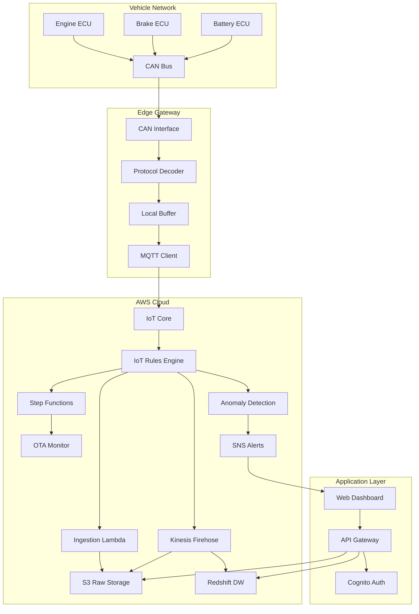

# Design Document

## Overview

The ECU Diagnostics System is a distributed IoT architecture that captures vehicle telemetry from CAN bus networks, processes it at the edge, streams it to AWS cloud services, and provides real-time monitoring and predictive analytics. The system consists of three primary layers:

1. **Edge Layer**: Raspberry Pi or similar edge gateway running Python services for CAN bus interfacing, protocol decoding, and local buffering
2. **Cloud Layer**: AWS services (IoT Core, Lambda, S3, Redshift, Step Functions) for data ingestion, storage, processing, and orchestration
3. **Application Layer**: Web-based dashboard for visualization, alerting, and analytics

The design prioritizes reliability, scalability, and offline operation capability while maintaining low latency for critical alerts.

## Architecture

### High-Level Architecture Diagram



### Component Architecture

The system follows a microservices pattern with clear separation of concerns:

- **Edge Services**: Autonomous Python microservices for data acquisition and preprocessing
- **Cloud Services**: Serverless AWS Lambda functions for event-driven processing
- **Storage Services**: S3 for raw data lake, Redshift for structured analytics
- **Orchestration**: Step Functions for OTA workflow management
- **Presentation**: React-based dashboard with real-time WebSocket updates


## Components and Interfaces

### 1. Edge Gateway Components

#### CAN Interface Service
- **Technology**: Python with python-can library
- **Responsibilities**:
  - Initialize CAN bus connection (SocketCAN on Linux)
  - Read CAN frames continuously
  - Apply CAN ID filters for relevant ECUs
  - Timestamp frames with high precision
- **Configuration**:
  - CAN interface: can0
  - Bitrate: 500000 (configurable)
  - Buffer size: 10000 frames
- **Interface**: Publishes CAN frames to internal message queue

#### Protocol Decoder Service
- **Technology**: Python with custom UDS/OBD-II parsers
- **Responsibilities**:
  - Decode UDS messages (ISO 14229)
  - Parse OBD-II Mode 01, 03 responses
  - Extract DTCs with status and severity
  - Convert PID values to engineering units
  - Validate message checksums
- **Libraries**:
  - `udsoncan` for UDS protocol handling
  - `obd` for OBD-II parsing
- **Interface**: Consumes CAN frames, produces structured telemetry JSON

#### Local Buffer Service
- **Technology**: Python with SQLite for persistence
- **Responsibilities**:
  - Buffer telemetry messages during network outages
  - Implement FIFO queue with 1GB capacity
  - Batch messages (256KB or 5-second window)
  - Compress batches with gzip
  - Track buffer utilization
- **Storage Schema**:
  ```sql
  CREATE TABLE telemetry_buffer (
    id INTEGER PRIMARY KEY,
    timestamp REAL,
    batch_data BLOB,
    transmitted BOOLEAN DEFAULT 0
  );
  ```
- **Interface**: Provides batches to MQTT client


#### MQTT Client Service
- **Technology**: Python with paho-mqtt and AWS IoT SDK
- **Responsibilities**:
  - Maintain secure connection to AWS IoT Core
  - Authenticate using X.509 certificates
  - Publish telemetry to `vehicle/{vin}/telemetry`
  - Publish heartbeat to `vehicle/{vin}/status`
  - Implement exponential backoff retry logic
  - Handle connection state transitions
- **Configuration**:
  - Endpoint: {account-id}.iot.{region}.amazonaws.com
  - Port: 8883 (MQTT over TLS)
  - Keep-alive: 60 seconds
  - QoS: 1 (at least once delivery)
- **Interface**: Consumes batches from buffer, publishes to AWS IoT

### 2. AWS Cloud Components

#### IoT Core Configuration
- **Thing Registry**: One Thing per vehicle with VIN as Thing Name
- **Certificates**: X.509 certificates provisioned per vehicle
- **Policies**: IoT policies allowing publish to vehicle-specific topics
- **Rules Engine**: SQL-based rules for message routing

**Key IoT Rules**:
```sql
-- Rule 1: Route telemetry to S3 via Kinesis Firehose
SELECT * FROM 'vehicle/+/telemetry'

-- Rule 2: Trigger anomaly detection Lambda
SELECT * FROM 'vehicle/+/telemetry' 
WHERE get(telemetry, "type") IN ['engine', 'brake', 'battery']

-- Rule 3: Route OTA status updates to Step Functions
SELECT * FROM 'vehicle/+/ota/status'
```

#### Ingestion Lambda Function
- **Runtime**: Python 3.11
- **Responsibilities**:
  - Validate incoming telemetry schema
  - Enrich with metadata (region, timestamp)
  - Write raw JSON to S3
  - Emit CloudWatch metrics
- **Triggers**: IoT Rules Engine
- **Memory**: 512 MB
- **Timeout**: 30 seconds
- **Environment Variables**:
  - S3_BUCKET: telemetry-raw-{account-id}
  - S3_PREFIX: telemetry/year={yyyy}/month={mm}/day={dd}/


#### Kinesis Firehose Stream
- **Purpose**: Batch and transform telemetry for Redshift
- **Configuration**:
  - Buffer size: 5 MB
  - Buffer interval: 300 seconds
  - Compression: GZIP
  - Transformation: Lambda for JSON flattening
- **Destinations**:
  - Primary: Redshift via COPY command
  - Backup: S3 for failed records

#### Anomaly Detection Lambda
- **Runtime**: Python 3.11 with scikit-learn layer
- **Responsibilities**:
  - Apply statistical threshold checks
  - Calculate rolling z-scores
  - Load and apply ML models (isolation forest)
  - Generate anomaly scores
  - Publish alerts to SNS for critical anomalies
- **Triggers**: IoT Rules Engine (filtered messages)
- **Memory**: 1024 MB
- **Timeout**: 60 seconds
- **Layers**: 
  - scikit-learn (ML models)
  - numpy/pandas (data processing)
- **Environment Variables**:
  - MODEL_BUCKET: ml-models-{account-id}
  - SNS_TOPIC_ARN: arn:aws:sns:{region}:{account}:critical-alerts
  - THRESHOLD_CONFIG: JSON string with parameter thresholds

#### OTA Monitoring Step Function
- **State Machine Type**: Standard
- **States**:
  1. **Initiated**: Record OTA start, capture baseline metrics
  2. **Downloading**: Monitor download progress, timeout after 10 minutes
  3. **Installing**: Track installation status, timeout after 5 minutes
  4. **Verifying**: Validate firmware version and ECU health
  5. **Completed**: Record success metrics
  6. **Failed**: Capture error logs and rollback if needed
- **Triggers**: IoT Rules Engine on OTA initiation messages
- **Integrations**:
  - Lambda for state transitions
  - DynamoDB for state persistence
  - SNS for failure notifications


#### S3 Storage Structure
```
telemetry-raw-{account-id}/
├── telemetry/
│   ├── year=2025/
│   │   ├── month=01/
│   │   │   ├── day=15/
│   │   │   │   ├── vehicle={vin}/
│   │   │   │   │   ├── {timestamp}-{uuid}.json.gz
├── ota-logs/
│   ├── vehicle={vin}/
│   │   ├── update={update-id}/
│   │   │   ├── logs.json
├── ml-models/
│   ├── engine/
│   │   ├── isolation_forest_v1.pkl
│   ├── brake/
│   │   ├── isolation_forest_v1.pkl
│   ├── battery/
│   │   ├── isolation_forest_v1.pkl
```

**Lifecycle Policies**:
- Raw telemetry: Transition to Glacier after 90 days
- OTA logs: Retain for 365 days
- ML models: Versioned, retain latest 5 versions

#### Redshift Data Warehouse
- **Cluster Type**: dc2.large (2 nodes for PoC, scale as needed)
- **Schema Design**: Star schema with fact and dimension tables

**Tables**:
```sql
-- Dimension: Vehicles
CREATE TABLE dim_vehicles (
  vehicle_key INTEGER IDENTITY(1,1) PRIMARY KEY,
  vin VARCHAR(17) UNIQUE NOT NULL,
  make VARCHAR(50),
  model VARCHAR(50),
  year INTEGER,
  firmware_version VARCHAR(20)
) DISTSTYLE ALL;

-- Fact: Telemetry
CREATE TABLE fact_telemetry (
  telemetry_key BIGINT IDENTITY(1,1) PRIMARY KEY,
  vehicle_key INTEGER REFERENCES dim_vehicles(vehicle_key),
  timestamp TIMESTAMP NOT NULL,
  parameter_name VARCHAR(50),
  parameter_value DOUBLE PRECISION,
  unit VARCHAR(20)
) DISTKEY(vehicle_key) SORTKEY(timestamp);

-- Fact: DTCs
CREATE TABLE fact_dtcs (
  dtc_key BIGINT IDENTITY(1,1) PRIMARY KEY,
  vehicle_key INTEGER REFERENCES dim_vehicles(vehicle_key),
  timestamp TIMESTAMP NOT NULL,
  dtc_code VARCHAR(10),
  status_byte INTEGER,
  severity VARCHAR(20),
  description TEXT
) DISTKEY(vehicle_key) SORTKEY(timestamp);

-- Fact: Anomalies
CREATE TABLE fact_anomalies (
  anomaly_key BIGINT IDENTITY(1,1) PRIMARY KEY,
  vehicle_key INTEGER REFERENCES dim_vehicles(vehicle_key),
  timestamp TIMESTAMP NOT NULL,
  subsystem VARCHAR(50),
  anomaly_type VARCHAR(50),
  severity_score DOUBLE PRECISION,
  ml_score DOUBLE PRECISION,
  acknowledged BOOLEAN DEFAULT FALSE
) DISTKEY(vehicle_key) SORTKEY(timestamp);

-- Fact: OTA Updates
CREATE TABLE fact_ota_updates (
  ota_key BIGINT IDENTITY(1,1) PRIMARY KEY,
  vehicle_key INTEGER REFERENCES dim_vehicles(vehicle_key),
  update_id VARCHAR(50),
  start_time TIMESTAMP,
  end_time TIMESTAMP,
  status VARCHAR(20),
  from_version VARCHAR(20),
  to_version VARCHAR(20),
  error_message TEXT
) DISTKEY(vehicle_key) SORTKEY(start_time);
```


### 3. Application Layer Components

#### API Gateway
- **Type**: REST API with Lambda integration
- **Authentication**: Amazon Cognito User Pools
- **Endpoints**:
  - `GET /vehicles` - List all vehicles with health status
  - `GET /vehicles/{vin}` - Get vehicle details
  - `GET /vehicles/{vin}/telemetry` - Query telemetry data
  - `GET /vehicles/{vin}/dtcs` - Get current DTCs
  - `GET /vehicles/{vin}/anomalies` - Get anomaly history
  - `GET /vehicles/{vin}/ota` - Get OTA update history
  - `POST /anomalies/{id}/acknowledge` - Acknowledge alert
  - `GET /maintenance/predictions` - Get predictive maintenance list
- **CORS**: Enabled for dashboard domain
- **Rate Limiting**: 1000 requests per minute per user

#### Dashboard Service
- **Technology**: React 18 with TypeScript
- **State Management**: Redux Toolkit
- **Charting**: Recharts for time-series visualization
- **Real-time Updates**: WebSocket connection to API Gateway
- **Key Features**:
  - Fleet overview with health status cards
  - Vehicle detail page with live telemetry
  - Time-series charts with zoom and pan
  - Alert notification center
  - Predictive maintenance scheduler
  - Historical trend comparison tool
- **Deployment**: S3 + CloudFront for static hosting

#### Authentication Service
- **Technology**: Amazon Cognito
- **User Pools**: Separate pools for fleet managers and engineers
- **MFA**: Optional TOTP-based MFA
- **Groups**: 
  - `FleetManagers` - Full access
  - `Engineers` - Read-only access to technical data
  - `Operators` - Alert acknowledgment only


## Data Models

### Telemetry Message Schema

```json
{
  "messageId": "uuid-v4",
  "vin": "1HGBH41JXMN109186",
  "timestamp": "2025-01-15T10:30:45.123Z",
  "gatewayId": "edge-gateway-001",
  "telemetryType": "obd2",
  "data": {
    "engineRpm": {
      "value": 2500,
      "unit": "rpm",
      "pid": "0x0C"
    },
    "vehicleSpeed": {
      "value": 65,
      "unit": "km/h",
      "pid": "0x0D"
    },
    "coolantTemp": {
      "value": 92,
      "unit": "celsius",
      "pid": "0x05"
    },
    "throttlePosition": {
      "value": 45.5,
      "unit": "percent",
      "pid": "0x11"
    }
  }
}
```

### DTC Message Schema

```json
{
  "messageId": "uuid-v4",
  "vin": "1HGBH41JXMN109186",
  "timestamp": "2025-01-15T10:30:45.123Z",
  "telemetryType": "dtc",
  "data": {
    "dtcs": [
      {
        "code": "P0301",
        "description": "Cylinder 1 Misfire Detected",
        "status": "confirmed",
        "statusByte": "0x08",
        "severity": "high",
        "ecuAddress": "0x7E0"
      }
    ]
  }
}
```

### UDS Diagnostic Session Schema

```json
{
  "messageId": "uuid-v4",
  "vin": "1HGBH41JXMN109186",
  "timestamp": "2025-01-15T10:30:45.123Z",
  "telemetryType": "uds",
  "data": {
    "service": "0x22",
    "serviceName": "ReadDataByIdentifier",
    "ecuAddress": "0x7E0",
    "dataIdentifier": "0xF190",
    "response": "48656C6C6F",
    "decoded": {
      "vinNumber": "1HGBH41JXMN109186"
    }
  }
}
```


### Anomaly Event Schema

```json
{
  "anomalyId": "uuid-v4",
  "vin": "1HGBH41JXMN109186",
  "timestamp": "2025-01-15T10:30:45.123Z",
  "subsystem": "engine",
  "anomalyType": "temperature_spike",
  "severity": "critical",
  "severityScore": 95,
  "mlScore": 0.87,
  "detectionMethod": "statistical_threshold",
  "parameters": {
    "coolantTemp": {
      "value": 112,
      "threshold": 105,
      "unit": "celsius"
    }
  },
  "acknowledged": false,
  "acknowledgedBy": null,
  "acknowledgedAt": null
}
```

### OTA Update Event Schema

```json
{
  "updateId": "ota-update-12345",
  "vin": "1HGBH41JXMN109186",
  "ecuAddress": "0x7E0",
  "ecuName": "Engine Control Module",
  "startTime": "2025-01-15T10:00:00.000Z",
  "endTime": "2025-01-15T10:15:30.000Z",
  "status": "completed",
  "fromVersion": "1.2.3",
  "toVersion": "1.2.4",
  "downloadProgress": 100,
  "installProgress": 100,
  "verificationStatus": "passed",
  "performanceMetrics": {
    "cpuUtilization": 45,
    "memoryUsage": 62,
    "responseTime": 120
  },
  "errorMessage": null
}
```

## Error Handling

### Edge Gateway Error Handling

**CAN Bus Connection Failures**:
- Retry connection every 5 seconds
- Log error to local file system
- Publish gateway status as "degraded" to IoT Core
- Continue buffering if previously connected

**Protocol Decoding Errors**:
- Log malformed messages with raw hex dump
- Increment error counter metric
- Continue processing subsequent messages
- Alert if error rate exceeds 5% of messages

**MQTT Connection Failures**:
- Implement exponential backoff (1s, 2s, 4s, 8s, max 60s)
- Buffer messages locally during outage
- Rotate logs if buffer approaches capacity
- Publish reconnection event when restored


### Cloud Service Error Handling

**Lambda Function Errors**:
- Automatic retry with exponential backoff (AWS default)
- Dead Letter Queue (DLQ) for failed messages after 3 retries
- CloudWatch alarms on error rate > 1%
- SNS notification to engineering team

**Redshift Load Failures**:
- Kinesis Firehose automatic retry
- Failed records written to S3 error bucket
- Daily batch job to reprocess failed records
- Alert if failure rate exceeds 0.1%

**Step Function Failures**:
- Catch blocks for each state with error logging
- Automatic rollback for failed OTA updates
- SNS notification to vehicle owner and engineering
- Manual intervention workflow for persistent failures

**API Gateway Errors**:
- 4xx errors: Return descriptive error messages
- 5xx errors: Log to CloudWatch, return generic error
- Circuit breaker pattern for downstream service failures
- Fallback to cached data when Redshift unavailable

### Data Quality and Validation

**Schema Validation**:
- JSON Schema validation at ingestion Lambda
- Reject messages with missing required fields
- Log validation errors with message sample
- Emit CloudWatch metric for validation failures

**Data Sanitization**:
- Remove PII from telemetry messages
- Validate VIN format (17 characters, alphanumeric)
- Clamp sensor values to physically possible ranges
- Detect and flag timestamp anomalies (future dates, large gaps)

**Duplicate Detection**:
- Use messageId for deduplication in Redshift
- 5-minute deduplication window in IoT Rules
- Track duplicate rate as data quality metric


## Testing Strategy

### Unit Testing

**Edge Gateway Services**:
- Mock CAN bus interface with simulated frames
- Test protocol decoders with known good/bad messages
- Verify buffer overflow handling
- Test MQTT retry logic with connection failures
- Coverage target: 80%

**Lambda Functions**:
- Mock AWS SDK calls (S3, SNS, DynamoDB)
- Test with valid and invalid message schemas
- Verify error handling paths
- Test anomaly detection thresholds
- Coverage target: 85%

**Dashboard Components**:
- Jest + React Testing Library
- Test component rendering with mock data
- Test user interactions (filters, date ranges)
- Test WebSocket reconnection logic
- Coverage target: 75%

### Integration Testing

**Edge-to-Cloud Flow**:
- Deploy test edge gateway with simulated CAN data
- Verify end-to-end message flow to S3 and Redshift
- Test offline buffering and recovery
- Validate data integrity across pipeline

**OTA Workflow**:
- Trigger Step Function with test OTA events
- Verify state transitions and timeouts
- Test failure scenarios and rollback
- Validate performance metric collection

**API Integration**:
- Test all API endpoints with Postman/Newman
- Verify authentication and authorization
- Test query performance with large datasets
- Validate CORS and rate limiting


### Performance Testing

**Load Testing**:
- Simulate 100 vehicles sending telemetry at 1Hz
- Target: < 2 second end-to-end latency (edge to Redshift)
- Target: < 500ms API response time (p95)
- Target: IoT Core throughput of 1000 messages/second

**Stress Testing**:
- Test buffer capacity with extended network outage
- Verify graceful degradation under high load
- Test Redshift query performance with 1 year of data
- Validate dashboard performance with 1000 concurrent users

**Anomaly Detection Performance**:
- Target: < 2 seconds for statistical threshold detection
- Target: < 5 seconds for ML model inference
- Test with burst of 100 anomalies simultaneously
- Verify alert deduplication under high anomaly rate

### Security Testing

**Penetration Testing**:
- Test IoT certificate validation
- Attempt unauthorized API access
- Test SQL injection on API parameters
- Verify encryption at rest and in transit

**Compliance Testing**:
- Verify data retention policies
- Test audit logging completeness
- Validate PII handling and anonymization
- Ensure GDPR compliance for vehicle data

## Deployment Strategy

### Infrastructure as Code
- Use AWS CDK (Python) for all infrastructure
- Separate stacks for edge, cloud, and application layers
- Environment-specific configurations (dev, staging, prod)
- Automated deployment via CI/CD pipeline

### Edge Gateway Deployment
- Ansible playbooks for gateway provisioning
- Docker containers for Python services
- Automatic certificate provisioning via AWS IoT
- Remote update capability for gateway software

### Monitoring and Observability
- CloudWatch dashboards for system health
- X-Ray tracing for distributed requests
- Custom metrics for business KPIs
- PagerDuty integration for critical alerts

